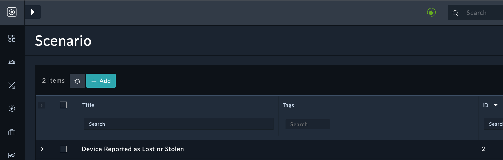
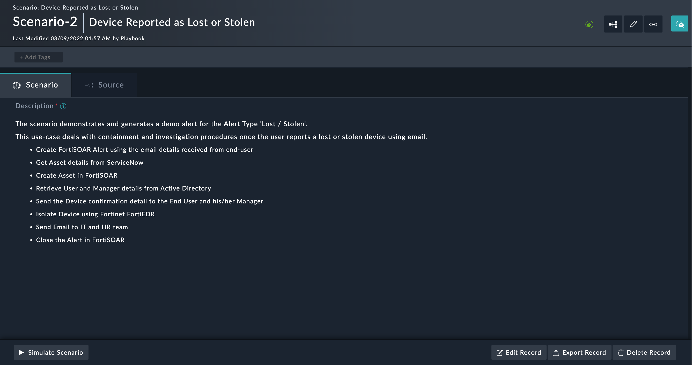
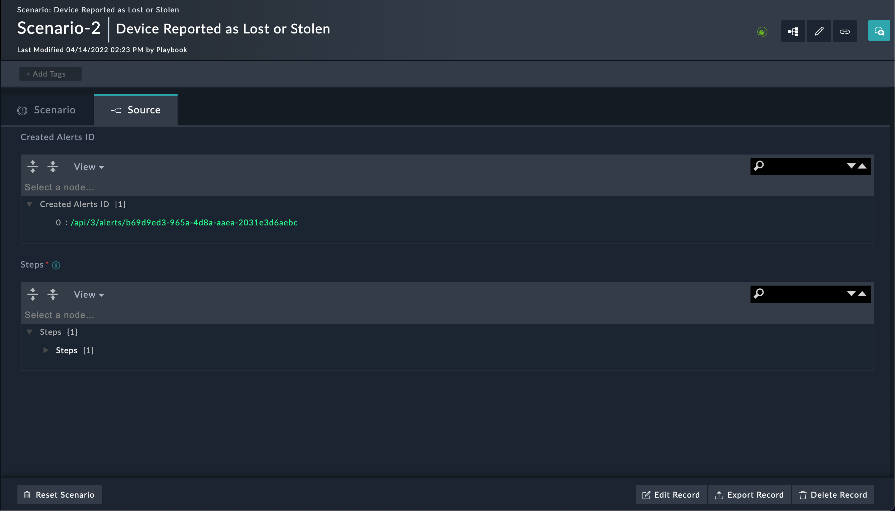
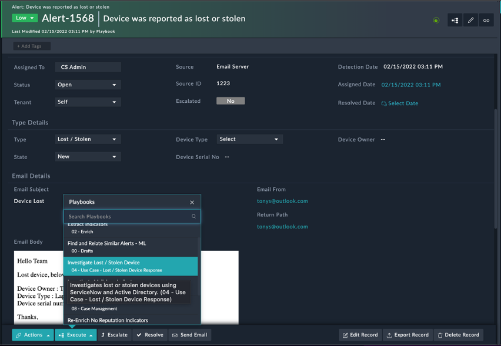

# Usage Lost / Stolen Device Response Solution Pack
## Use Case Workflow
This solution pack contains two types of execution workflows
- Scenario-based Workflow
- Investigate Lost or Stolen Device Response Playbook Workflow

## Scenario-based Workflow
The scenario demonstrates and generates a demo alert for the Alert Type “Lost / Stolen“.

Please refer to the below step to execute scenarios
1.	Go to the ‘Simulations’ menu in Navigation and choose “Lost / Stolen” scenario.
      
2. Open a “Lost / Stolen” scenario and Click on “Simulate Scenario“ button.
     
3. Check demo Alert record “Device was reported as lost or stolen” is created for the scenario in Alert module.
     
4. The created Alerts records IRI will be mapped in the Scenario record detail view under the Source tab.
    

## Investigate Lost or Stolen Device Response Playbook Workflow
Please refer to the below step to execute the use-case
1.	Open the “Device was reported as lost or stolen” alert in detail view, click on the execute button to execute the “Investigate Lost or Stolen Device Response” usecase.
    